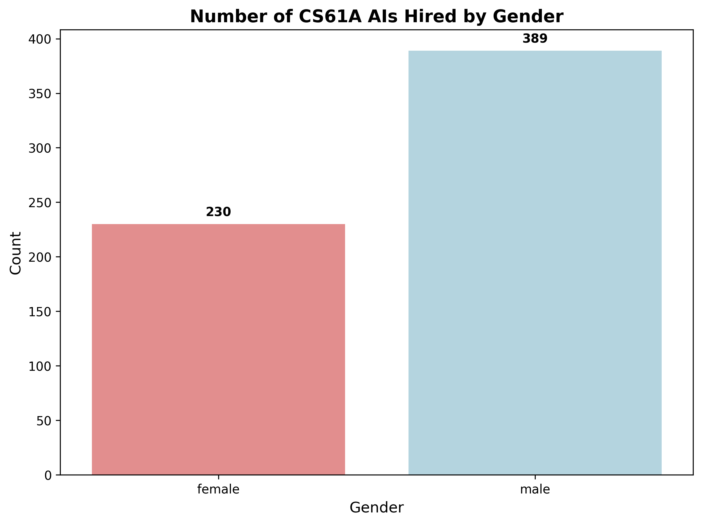
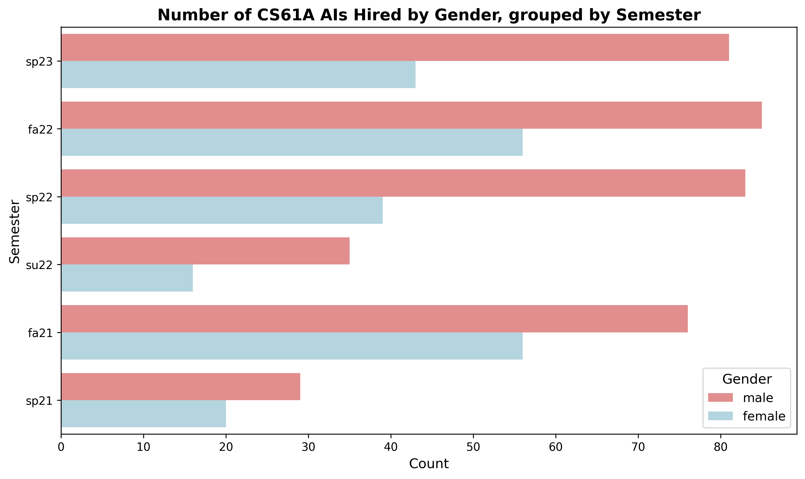
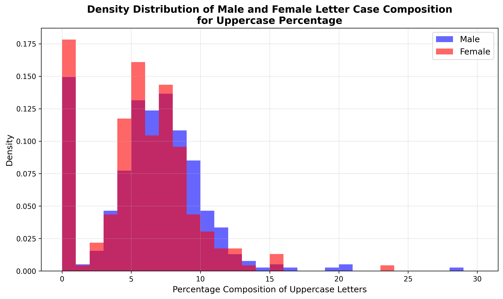
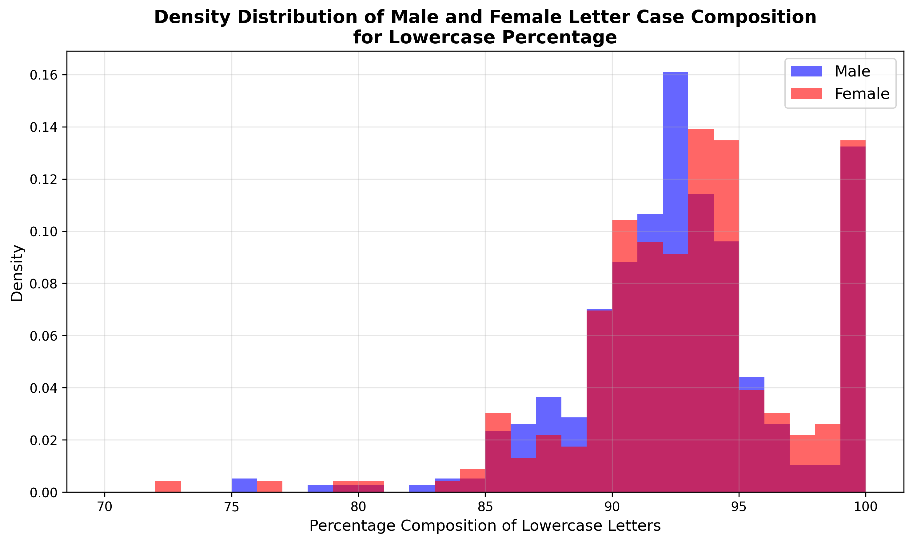
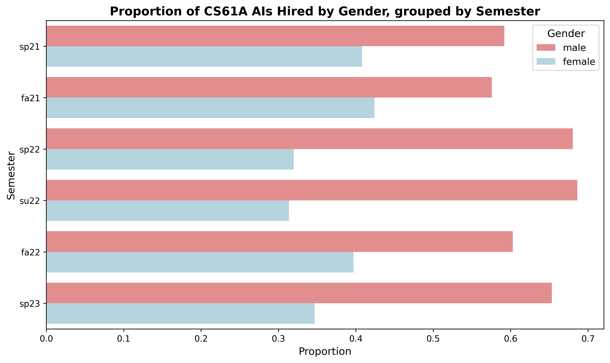
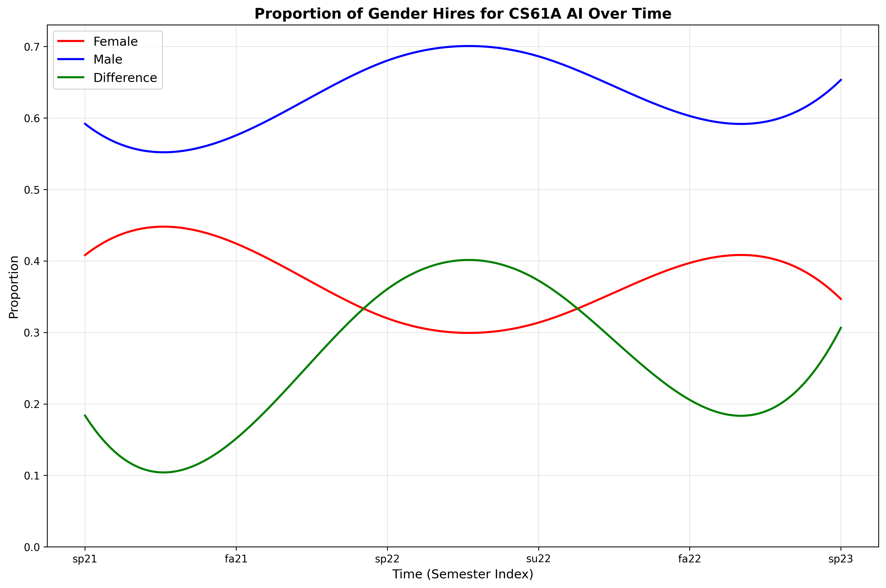
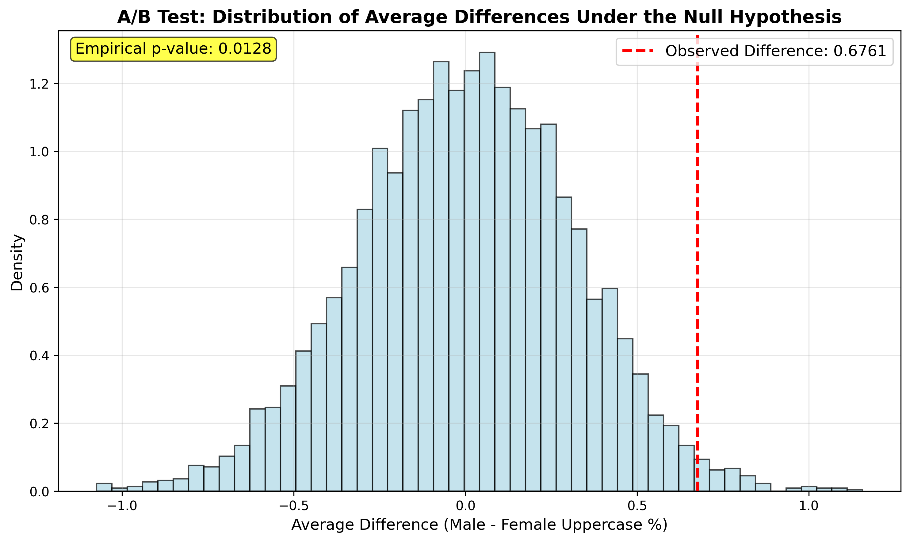

# Gender and Proper Case Usage in Academic Communication: An Analysis of UC Berkeley CS61A Academic Interns

## Abstract

This study examines gender-based differences in letter case composition within academic communication contexts. Using data scraped from UC Berkeley's CS61A Academic Intern (AI) program across six semesters (Spring 2021 through Spring 2023), we analyzed the biographical text of 619 students to test the hypothesis that women are more likely to use lowercase letters in their academic communications. Through exploratory data analysis, feature engineering, and A/B hypothesis testing, we found statistically significant evidence supporting the hypothesis that female AIs use proper case less frequently than their male counterparts, with an empirical p-value of 0.0128 (α = 0.05).

## Summary

This project investigates whether gender influences letter case usage patterns in academic settings, specifically examining the biographical descriptions written by UC Berkeley CS61A Academic Interns. The research was motivated by anecdotal observations that women tend to use lowercase letters more frequently in digital communications, potentially to convey a "softer" or more approachable tone.

The study scraped and analyzed data from 643 Academic Interns across six semesters, ultimately focusing on 619 individuals with complete pronoun and biographical information. Key findings include:

- **Gender Distribution**: 37% female AIs vs 63% male AIs, representing a 51% gender disparity
- **Letter Case Patterns**: Female AIs demonstrated lower uppercase letter usage (mean: 6.1%) compared to male AIs (mean: 6.8%)
- **Statistical Significance**: A/B testing yielded an empirical p-value of 0.0128, rejecting the null hypothesis at α = 0.05

*Figure 1: Overall gender distribution among CS61A Academic Interns across all semesters*

The research contributes to understanding gender-based communication patterns in academic contexts and provides quantitative evidence for previously anecdotal observations about gendered digital communication styles.

## Methodology

### Data Collection and Scraping

**Data Source**: UC Berkeley CS61A Academic Intern pages from six semesters:
- Spring 2021 (50 AIs)
- Fall 2021 (132 AIs) 
- Spring 2022 (125 AIs)
- Summer 2022 (54 AIs)
- Fall 2022 (152 AIs)
- Spring 2023 (130 AIs)

**Web Scraping Process**:
- Utilized Python's [`requests`](https://pypi.org/project/requests/) library for HTTP requests
- Employed regular expressions via Python's [`re`](https://docs.python.org/3/library/re.html) module for pattern extraction
- Extracted three primary features: names, pronouns, and biographical descriptions

**Data Challenges and Solutions**:
- **Complex name patterns**: Handled hyphens, parenthetical nicknames, special characters, and hyperlinked names
- **Pronoun inconsistencies**: Managed multi-set pronouns, missing pronoun entries, and non-standard pronouns (e.g., "comrade/comrade")
- **Bio formatting issues**: Addressed multiline bios, varying HTML structures across semesters
- **Manual imputation**: Required 5 manual entries across all semesters for edge cases

### Data Preprocessing and Feature Engineering

**Data Cleaning**:
- Removed entries with missing pronouns (17 entries, ~3% of data)
- Filtered for binary gender pronouns only (removed 7 non-binary entries)
- Cleaned biographical text using regex pattern: `[\s.,'!?;:()-]`

**Feature Engineering**:
1. **Gender Mapping**: 
   - 'he/him/his' → 'male'
   - 'she/her/hers' → 'female'

2. **Letter Case Composition (LCC) Features**:
   - `letter_count`: Total characters in cleaned bio
   - `uppercase_count`: Number of uppercase letters
   - `lowercase_count`: Number of lowercase letters
   - `uppercase_percentage`: (uppercase_count / letter_count) × 100
   - `lowercase_percentage`: (lowercase_count / letter_count) × 100

### Statistical Analysis Tools

**Libraries and Frameworks**:
- [`pandas`](https://pandas.pydata.org/) for data manipulation
- [`matplotlib`](https://matplotlib.org/) and [`seaborn`](https://seaborn.pydata.org/) for visualization
- [`numpy`](https://numpy.org/) for numerical operations
- [`scipy.interpolate`](https://docs.scipy.org/doc/scipy/reference/interpolate.html) for data smoothing

**Analytical Approaches**:
1. **Exploratory Data Analysis**: Distribution analysis, gender proportion calculations
2. **Temporal Analysis**: Semester-by-semester gender representation trends
3. **Hypothesis Testing**: A/B test with 5,000 simulations under the null hypothesis

### Hypothesis Testing Framework

**Null Hypothesis**: Distribution of female AI `uppercase_percentage` equals male AI `uppercase_percentage`

**Alternative Hypothesis**: Female AI `uppercase_percentage` is lower than male AI `uppercase_percentage`

**Test Statistic**: Difference in means (male - female uppercase percentage)

**Significance Level**: α = 0.05

**Method**: Permutation-based A/B test with label shuffling

## Conclusion of Findings

### Primary Research Question

The study successfully demonstrated that female Academic Interns in UC Berkeley's CS61A program use proper case significantly less frequently than their male counterparts. The empirical evidence strongly supports the hypothesis that women are more likely to employ lowercase letters in their academic biographical descriptions.

### Key Statistical Results

1. **Gender Disparity in Representation**: The CS61A AI program shows a persistent gender imbalance, with male students comprising 63% of AIs versus 37% female students across all analyzed semesters.

*Figure 2: Gender distribution by semester showing consistent male majority across all time periods*

2. **Letter Case Usage Patterns**:
   - **Female AIs**: Mean uppercase percentage of 6.1%
   - **Male AIs**: Mean uppercase percentage of 6.8%
   - **Observed Difference**: 0.68 percentage points

*Figure 3: Density distribution of uppercase letter usage by gender, showing female AIs using fewer uppercase letters*

*Figure 4: Density distribution of lowercase letter usage by gender, showing female AIs using more lowercase letters*

3. **Temporal Trends**: Gender diversity remained largely stagnant across the six-semester period, with a slight improvement in Fall 2022 that was reversed by Spring 2023.

*Figure 5: Gender proportions by semester showing persistent male majority with minimal variation*

*Figure 6: Smoothed temporal trends showing stable gender proportions and differences over time*

4. **Statistical Significance**: The A/B test yielded an empirical p-value of 0.0128 (p < 0.05), providing strong evidence to reject the null hypothesis.

*Figure 7: A/B test results showing the distribution of differences under the null hypothesis, with observed difference marked in red*

### Distribution Analysis

Density histogram analysis revealed distinct patterns:
- **Male Distribution**: Bimodal with peaks at 0% and ~7% uppercase usage
- **Female Distribution**: Trimodal with peaks at 0%, 6%, and 8%, with lower overall uppercase percentages

The visualizations clearly demonstrate that female AIs consistently show lower uppercase letter usage across all measured dimensions, supporting the hypothesis that women are more likely to use lowercase letters in their academic communications.

### Limitations and Generalizability

While the results provide compelling evidence within the specific context of UC Berkeley's CS61A program, several limitations affect broader generalizability:

1. **Sample Scope**: Limited to a specific academic program at one institution
2. **Temporal Constraints**: Data spans only 2.5 years (2021-2023)
3. **Context Specificity**: Academic biographical descriptions may not represent broader communication patterns
4. **Sample Size**: 619 individuals, while substantial, represents a narrow demographic

### Implications

The findings contribute to the growing body of research on gendered communication patterns in digital spaces. The evidence suggests that even in formal academic contexts, subtle gender-based communication differences persist. This research provides quantitative support for previously anecdotal observations about gender and digital communication styles.

The results align with broader sociolinguistic research suggesting that women may employ different stylistic choices in written communication, potentially reflecting socialized communication norms or strategic self-presentation approaches in academic and professional contexts.

---

*This analysis was conducted as an independent research project examining gender-based communication patterns in academic settings. All data was publicly available through UC Berkeley's CS61A course websites.*
