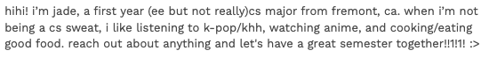
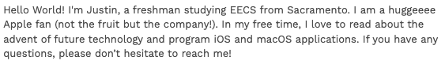

# gender-proper-case-usage

This is a personal project that I started on 4/15/2023.

Starting in highschool and continuing throughout my experience in university, I came to observe a rather pecular behavior by women when they send messages or text; they seem to use *lowercase letters* a lot more frequently than men. Sounds kind of dumb and trivial (which it is), but regardless I was curious. Allow me to elaborate, take a look at the following two pictures I pulled from [UC Berkeley's Spring 2023 CS61A Academic Intern (AI)](https://cs61a.org/academic-interns/) page:

VERSUS

You'll have to take my word for this ([or take a look for yourself](https://cs61a.org/academic-interns/)), but the former identifies as a female with she/her/hers pronouns and the latter as a male with he/him/his pronouns. But notice how the female AI uses **all** lowercase letters. Letters after punctuation are not capitalized, proper nouns are not capitalized (Fremont and CA), and major abbreviations, although not a *set* rule, are also not capitalized (EE for Electrical Engineering and CS for Computer Science). Looking at the latter, we see the complete opposite. He capitalizes his name, his major, his city, and even follows the stylization of Apple products, iOS and macOS.

My memory is not perfect, but from my experiences in highschool and university, there were many counts where I've observed this contrast in behavior.

So months ago, I decided to bring this up as a conversation topic with a group of my friends. One agreed with me and the other claimed to not have noticed. Regardless, we started to brainstorm theories as to why this was the case. My personal theory in *normal* terms (see how I really word my theory in `analysis.ipynb`) is that women conduct this behavior because it gives off a more gentle vibe, giving them *softer* tone, ultimately making them seem more approachable.

Of course theories like this are not testable, but while I was working on the project, I came to the realization a hypothesis test *can* be conducted; and that's why I did.

As for my data set, my knowledge in python limited me to simple web scraping techniques. Thus, I scraped the Berkeley's 61A Academic Intern pages of various semesters (process explained in furhter detail in `scraper.ipynb`). With the data of $644$ AIs I cleaned, transformed, and added features to the data so that I could perform an A/B test.

Quick disclaimer. Due to the trivialness nature of this project, I do not know of many proper test statistics and methods to use in these type of excursions, so I had to make up some definitions. Regardless, I explain the reasoning behind each of my steps thoroughly in `analysis.ipynb`, so I think it warrants some degree of credibility. 

To perform the A/B test, I had to formalize the question, so I used the following set of hypotheses:

**Null Hypothesis:** In CS61A, distribution of female AI `uppercase_percentage` is the same as male AI `uppercase_percentage`. Any differences in the sample is simply due to chance.

**Alternative Hypothesis:** In CS61A, the distribution of female AI `uppercase_percentage` is on average *lower* than male AI `uppercase_percentage`.

In addition to the test, I also conducted some simple analysis on the gender gap in Academic Intern hiring. Since I've already put in effort in scraping the data (was kind of a headache with all the edge cases to consider using regex), I thought might as well right?

As of 4/17/2023, the project is mostly finished, and I conclude my findings in `analysis.ipynb`.
